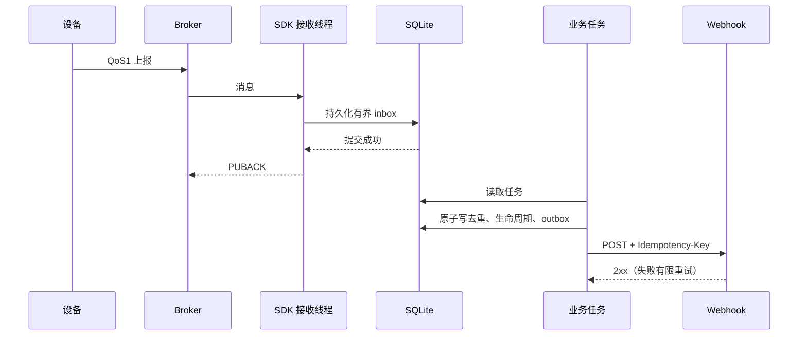

# 服务运维与排障

- `/health` 为 degraded：核对各 connectionId/deviceId 订阅是否连接。Broker 不在线时 HTTP 仍应响应，重连不代表设备在线；最终以 RPC/上报为准。
- `504 RPC_TIMEOUT`：设备可能已执行。先查询属性、标靶、测量或证据状态，勿自动重发修改请求。
- `502 DEVICE_ERROR`：保留 `deviceCode`，按设备错误码处理。公开路由存在不代表该型号支持此参数。
- `409 UNSUPPORTED_CAPABILITY`：只有经设备/供应方验证的型号才能设置 `motor`。不要为绕过错误而给所有设备开启。
- `400 INVALID_ARGUMENT`：检查 params 是对象，按配置 format 使用 JSON/ProtoJSON；检查整数范围、oneof、64 位 ID 字符串。证据 ACK 还需本地已校验回执。
- 收不到消息：核对实际设备 Topic、读写 ACL、JSON/Protobuf 配置与 Broker 最大报文限制。服务当前使用标准 `vdm/{deviceId}/...`。
- 收到重复通知：Webhook 传输可能重复，接收方以 `Idempotency-Key` 去重。清空数据库或保留期外的重放可能再次出现，不能承诺永久去重。
- failed/dead-letter 计数增长：检查日志和 SQLite 中失败任务的错误。容量、格式、网络失败分别处理；任务最多重试 8 次。停止实例并备份数据库后才做人工重放，勿清空 pending 队列。
- 告警迟到/同时间戳：事件记录保留，安排 `getAlarmState` 核对；不把接收顺序当作设备顺序。SYNCED 不通知，默认过期和未来事件不通知。
- 图像未确认：核对缺块、SHA-256、安全 USTAR 校验和容量。仅 Broker PUBACK 不代表证据完整。修复后调用 evidence/retry 重新上传，禁止伪造 ACK。
- 磁盘容量：配置 maxInboxRows、maxEvidenceBytes、retentionDays。完成任务/历史按保留期清理，待处理/失败任务和未确认图像不能任意删除。磁盘不足时 QoS1 不确认，QoS0 无补偿保证。
- 备份/部署：一目录一实例，包含 SQLite/WAL 与图像目录；使用持久卷，先停止服务或用 SQLite 在线备份。示例不支持多实例共享 SQLite。
- 远程访问：配置 VDM_API_TOKEN，HTTP 经 TLS 代理；Broker 使用受控网络或安全隧道。本版本各 SDK 的默认传输为 MQTT TCP，不宣称提供未实现的 TLS 参数。

设备写入、网络传输和平台落库是不同边界。上述测试不等于弱电/断电零丢失保证。
