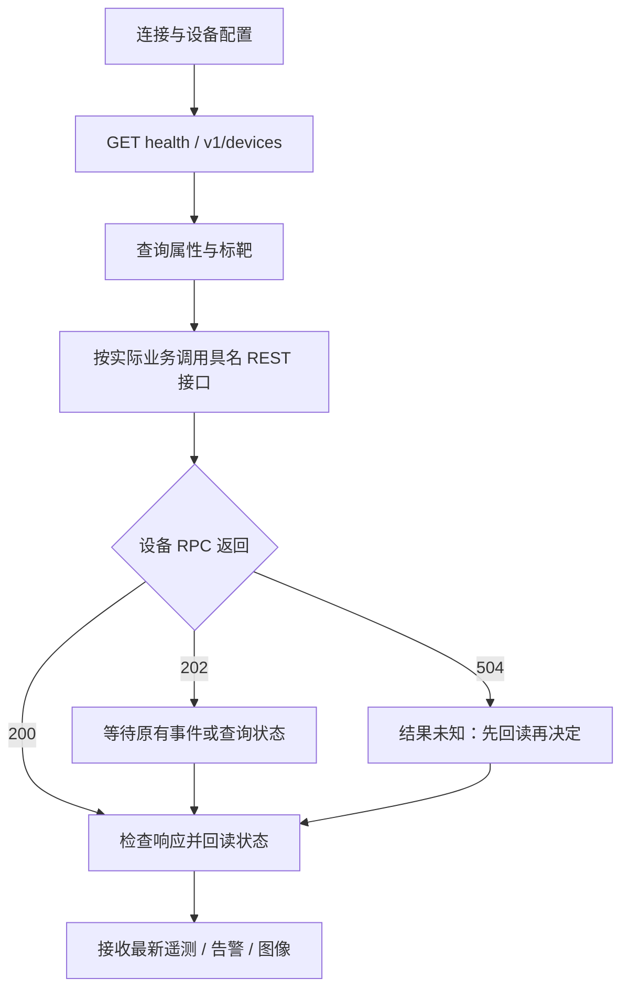

# 业务调用与结果核对

下列路径都以 `/v1/connections/{connectionId}/devices/{deviceId}/` 开头，
POST body 为 `{"params":{...}}`。先替换连接、设备、标靶 ID；有写操作的样例
只有在业务确需执行且记录了原状态后才运行。JSON/ProtoJSON 参数示例见
[共享请求](../tests/fixtures/rpc-cases.json)，告警完整规则见
[告警样例](../examples/alarms/requests.json)。

| 业务 | 调用顺序 | 核对方式 |
|---|---|---|
| 设备 | device/attributes/query → 必要时 device/attributes/update | 再次 query 核对实际属性；超时也先回读 |
| 标靶 | targets/query → targets/add/update → targets/initialize | 202 后查询 targets/query 的 initialized/initializedAtS；也可接收 REF_INIT_RESULT 事件 |
| 测量 | 查询标靶初始化状态 → measurement/start | 查询设备测量状态；GET latest 确认可见位移数组/接收计数增长 |
| 补光 | device/lights/query → device/lights/update | 重新 query 核对每路灯状态 |
| 抓拍 | evidence/snapshot | 202 后接收二进制图像；持久卷 evidence 目录检查 JPEG，不能把202当作图像落盘 |
| 告警 | alarms/capabilities → alarms/rules/query → alarms/rules/apply | 再查询规则；alarms/state 为设备状态，GET alarms/local 为本服务已接收的生命周期 |
| 历史 | alarms/history 或 alarms/events | 按 page/pageSize 或支持的 cursor 分页；两者分别为生命周期和变化事件 |
| 证据 | evidence/status → 必要时 evidence/retry | 图像分块完整、SHA-256/USTAR 校验和落盘后，服务后台自动 ACK；再次 status 确认设备结果 |
| 遥测补传 | measurement/sync | 202 后使用 jobId 调 measurement/sync/status；需要取消时 measurement/sync/cancel |
| 电机/巡航 | 先确认 motor 能力，再查询角度/路径 | 移动受理后回读角度；单设备测试不代表所有型号支持 |

`device/time/sync`、`device/reboot` 等操作会影响设备运行，示例不自动执行。
服务不自动重发超时修改 RPC。MQTT QoS1 本身允许重复投递，因此没有“设备操作
恰好执行一次”的保证；应根据回读状态决定业务下一步。

本服务保持设备 payload 原样，JSON 与 Protobuf 的返回嵌套可能不同：例如
Protobuf getAttr 返回 `response.getAttr.attributes`，JSON 为 `response.data`。
四种语言在同一编码配置下使用同一 REST 外层响应契约。
