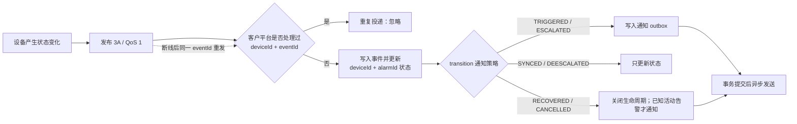

# 告警接入：设备推送与平台通知

设备负责判定告警并推送消息，客户平台负责保存告警、去重，以及发送短信、电话或 App 推送。**仅接入告警通知时，订阅 `vdm/{deviceId}/3A` 即可；不要每收到一条 MQTT 消息就通知一次。**

## 先了解如何运行

1. 平台通过 RPC 配置并启用设备告警规则；配置成功后回读核对。
2. 设备自行判定阈值和持续时间，有状态变化时主动发布 `/3A`，不需要平台轮询触发。
3. 平台持久化去重、更新告警状态，再根据 `transition` 决定是否创建通知任务。
4. 后台任务调用客户通知服务；最终发送端也须做幂等处理，避免重试产生重复通知。

### 三个主题，不是三次告警

| 默认主题 | 内容 | 平台用途 |
| --- | --- | --- |
| `vdm/{deviceId}/3A` | 告警触发、等级变化、恢复和同步 | **告警通知的入口** |
| `vdm/{deviceId}/event` | 其中 `type=ALARM_EVIDENCE` 表示证据状态，如 `READY`、`AVAILABLE` | 更新证据展示，不再次触发告警通知 |
| `vdm/{deviceId}/image` | 图片；告警证据为类型 2 的二进制包分块 | 接收、保存并确认图片，见[抓拍上传](#告警抓拍上传) |

`/event` 也可能承载其他设备事件，应先判断 `type`，不能全部当成告警。只做短信、电话或 App 告警通知时，无需订阅后两个主题；需要图片展示时再接入。

### 怎样判断是不是重复

| 字段 | 含义 | 使用方式 |
| --- | --- | --- |
| `alarmId` | 一轮告警的身份，从触发到恢复或取消 | 用 `deviceId + alarmId` 关联生命周期，不能据此丢弃所有后续状态 |
| `/3A.eventId` | 一次状态变化的身份 | 用 `deviceId + eventId` 持久化去重；同一消息重发时 ID 不变 |
| `/event.detail.eventId` | 证据所对应的告警事件 | 与 `/3A.eventId` 关联；`READY → AVAILABLE` 沿用该 ID，不是新的告警 |
| `ts` | 此次事件的生成时间，Unix 秒 | 不等于平台接收时间；排队、断线补发时可以明显早于接收时间 |

例如：同一个 `alarmId=A` 可以依次收到 `TRIGGERED(eventId=1)`、`SYNCED(eventId=2)`、`RECOVERED(eventId=3)`，它们不是重复事件。再次收到 `eventId=1` 才是该事件的重复投递。

### 为什么会收到 SYNCED

重启或 MQTT 重连后，设备用 `SYNCED` 同步仍然活动的告警：沿用 `alarmId`，生成新的 `/3A.eventId`。没有活动告警时不会因此发出 `SYNCED`。它不是新触发，也不是定时告警心跳，**平台只更新状态，不发外部通知**。

平台清除页面记录不会解除设备告警；应保留生命周期和去重记录，避免后续同步被误判为新告警。

### Java 示例覆盖范围

`AlarmNotificationConsumer` **只订阅 `/3A`**，由 `AlarmNotificationStore` 保存事件、告警状态和通知任务，`NotificationOutboxWorker` 再调用客户 Webhook。它不处理 `/event` 证据状态，也不直接对接短信或电话供应商。

证据业务应单独实现幂等更新，不能套用仅含 `eventId` 的告警去重键，否则会吞掉合法的证据状态变化。相同类型、关联事件、证据类型、状态及内容的重复通知只更新一次，不新建告警通知任务。

接入顺序：[通知策略与去重](#告警通知与防重复) → [运行示例](#运行) → [配置规则](#配置步骤)。完整请求和消息见下表。

各语言客户端使用同一组 [请求示例](requests.json) 和 [告警消息](events.json)，支持 Protobuf（推荐）与 JSON。默认只查询能力；加 `--print-only` 可查看请求并验证编码，不连接设备。

| 内容 | 示例 |
| --- | --- |
| 能力、规则、当前告警、历史 | `capabilities`、`list-rules`、`active-state`、`history`、`incident-history` |
| 新建五种规则 | `create-displacement`、`create-rate`、`create-target-lost`、`create-input-voltage`、`create-battery-voltage` |
| 完整更新并禁用、删除 | `update-disabled`、`delete-rule` |
| 六种状态变化 | [events.json](events.json)：触发、升级、降级、同步、恢复、取消 |

## 运行

示例运行在系统集成商的电脑或服务器上，与设备连接同一个 MQTT Broker。首次接入请先按[位移数据入门](../../README.md#receive-data)接收监测数据，再继续本页的告警操作。下列占位值需替换为实际参数；`VDM_PAYLOAD_FORMAT` 必须与设备该连接的格式一致。

在终端设置参数：

```bash
export MQTT_HOST=YOUR_BROKER_HOST  # 系统集成商提供的域名或 IP
export MQTT_PORT=1883              # 替换为系统集成商指定的端口
export VDM_DEVICE_ID=YOUR_DEVICE_ID # 要访问的设备 ID
export VDM_PAYLOAD_FORMAT=protobuf  # JSON 连接改为 json
# 按系统集成商要求设置 MQTT_USERNAME / MQTT_PASSWORD
```

连接本机 NanoMQ 时，设置 `MQTT_HOST=127.0.0.1`、`MQTT_PORT=18883`。选择一种语言；Python 复用位移入门的环境，其他语言从仓库根目录开始。最后一条命令查询设备能力，成功时打印 `RESPONSE`。尚未准备好设备时，加 `--print-only` 即可离线检查编码。

后续 `--case`、`--request` 等选项均替换所选语言运行命令的参数，并在对应语言目录执行。例如将 `--case capabilities` 换成 `--case active-state --listen 60`，可查询当前告警并继续接收 60 秒的 `3A` / `event` 消息。

### Python

[完整代码](../../python/alarm_rpc.py)。先完成[Python 准备与连接参数设置](../../README.md#python-setup)，在同一终端、`python/` 目录执行：

```bash
python alarm_rpc.py --case capabilities
```

### JavaScript

[完整代码](../../javascript/alarm_rpc.js)，要求 Node.js 22+。

```bash
cd javascript
npm ci
node alarm_rpc.js --case capabilities
```

### Go

[完整代码](../../go/cmd/alarm-rpc/main.go)，要求 Go 1.24+ 和 `protoc`。

```bash
cd go
go install google.golang.org/protobuf/cmd/protoc-gen-go@v1.36.5
export PATH="$(go env GOPATH)/bin:$PATH"
mkdir -p generated
protoc -I../proto --go_out=generated --go_opt=paths=source_relative ../proto/inteagle_vdm_mqtt_v1.proto
go run ./cmd/alarm-rpc --case capabilities
```

### Java

[完整代码](../../java/src/main/java/com/inteagle/examples/vdm/AlarmRpc.java)，要求 JDK 21+ 和 Maven。

```bash
cd java
mvn -q package
java -cp target/vdm-mqtt-consumer-1.0.0.jar com.inteagle.examples.vdm.AlarmRpc --case capabilities
```

以上是配置/调试入口，不要在 `AlarmRpc` 的打印回调里直接发短信或电话。正式通知使用下方的独立消费者和发送任务。

## 配置步骤

1. 查询 `getAlarmCaps`，按设备返回的等级、规则类型和动作能力提供配置选项；用 `getTargets` 获取实际标靶 ID。
2. 查询 `listAlarmRules`。选择 [requests.json](requests.json) 中对应格式的参数，替换标靶 ID，保存到所选语言目录的 `request.json`：`{"method":"applyAlarmRules","params":{...}}`。
3. 先执行 `--request request.json --print-only` 检查编码，再去掉 `--print-only` 提交。编码通过不代表设备业务校验通过，以 RPC 响应为准。
4. 新建后保存返回的 `createdIds`，再查询 `listAlarmRules` 核对。更新须提交完整规则，不能只发 `id` 和待改字段；禁用时保留完整配置并设 `enabled:false`。
5. 删除使用 `deleteIds:[实际规则ID]`；响应成功后再次查询确认。

新建示例均为 `enabled:false`，方便先回读检查。需要参与告警判定时，提交完整规则并改为 `true`。示例中的 `T01`、更新/删除用的 `12` 均须替换为实际值。

## 字段与格式

`requests.json` 中 `json` 是直接 MQTT JSON 的 `params`；`protobuf` 是交给 SDK 编码的 Protobuf 字段视图，在线发送的是二进制。

| 含义 | Protobuf 字段视图 | MQTT JSON |
| --- | --- | --- |
| 位移越限规则 | `upsert:[{"displacementLimit":{...}}]` | `type:"DISP_LIMIT"` |
| X 方向、双向判定 | `metric:"ALARM_METRIC_DX"`、`direction:"DISPLACEMENT_DIRECTION_BIDIRECTIONAL"` | `metric:"DX"`、`direction:"BIDIRECTIONAL"` |
| ALARM 阈值 | `levels:{"alarm":{"enter":10,"enterForMs":1000}}` | `levels:{"ALARM":{"enter":10,"enterForMs":1000}}` |
| 抓拍动作 | `actionType:"ALARM_ACTION_TYPE_SNAPSHOT"` | `type:"SNAPSHOT"` |

等级顺序为 `ALERT < ALARM < ACTION`，规则可只启用其中部分等级。位移单位 mm，电压单位 V。速率短窗口使用 mm/s，`windowMs=3600000` 使用 mm/h，`86400000` 使用 mm/day（本仓库速率示例为 3000 ms、mm/s）；规则持续时间和历史记录时间戳单位 ms，`3A` 时间戳单位秒。

以 `deviceId + alarmId` 关联生命周期，以 `deviceId + eventId` 去重状态变化。`RECOVERED`、`CANCELLED` 不携带 `level`；不能把缺失等级当成 `ALERT`。`alarmId`、`eventId` 在 JSON 和 SDK 的 Protobuf 可读视图中使用十进制字符串，避免 JavaScript 大整数精度丢失。规则 `id` / `ruleId` 使用数值。

## 告警通知与防重复

`3A` 是告警状态变化流，不等于“每收到一条就通知一次”。MQTT QoS 1 是至少一次投递；网络断开时设备保留未获 Broker PUBACK 的告警，重连后重发，并用 `SYNCED` 同步仍然活动的告警。客户平台必须先持久化去重和更新告警生命周期，再异步发送短信、电话或 App 推送。

完整因果关系如下：



推荐的默认通知策略：

| `transition` | 平台状态处理 | 默认是否发送外部通知 | 说明 |
| --- | --- | --- | --- |
| `TRIGGERED` | 新建或打开 `alarmId` | 是 | 第一次进入告警等级 |
| `ESCALATED` | 更新活动等级 | 是 | 等级上升，例如 `ALERT → ALARM` |
| `DEESCALATED` | 更新活动等级 | 否 | 默认只更新页面；需要时可由项目配置通知 |
| `SYNCED` | 覆盖当前活动状态 | 否 | 连接恢复同步，不是新告警，禁止据此通知 |
| `RECOVERED` | 关闭 `alarmId` | 是，前提是平台已知该告警活动 | 恢复通知只发送一次 |
| `CANCELLED` | 关闭 `alarmId` | 是，前提是平台已知该告警活动 | 规则禁用、删除或状态取消等终态 |

生产实现至少需要三个持久化约束，不能只使用进程内 `set`：

1. 告警事件表以 `(device_id, event_id)` 为唯一键；冲突表示 QoS 1 或断线重放，直接返回成功，不重复执行业务副作用。
2. 告警生命周期表以 `(device_id, alarm_id)` 为唯一键；`SYNCED` 只修正当前状态，`RECOVERED/CANCELLED` 关闭生命周期。
3. 通知 outbox 以 `(device_id, event_id, notification_type)` 为唯一键，并与前两项在同一数据库事务中提交；事务提交后再由后台任务发送通知。

Java 参考实现由
[AlarmNotificationConsumer](../../java/src/main/java/com/inteagle/examples/vdm/AlarmNotificationConsumer.java)
和 [AlarmNotificationStore](../../java/src/main/java/com/inteagle/examples/vdm/AlarmNotificationStore.java)
组成。前者负责 MQTT 接收，后者用 SQLite 事务实现 inbox、生命周期和 outbox；两种 Payload 格式解码后使用同一套策略。运行方式：

```bash
cd java
mvn -q package
java -cp target/vdm-mqtt-consumer-1.0.0.jar \
  com.inteagle.examples.vdm.AlarmNotificationConsumer \
  --database ./alarm-notifications.sqlite3
```

日志中的 `action` 有三种：`NOTIFY` 表示通知已安全写入 outbox，`STATE_ONLY` 表示仅更新状态，`DUPLICATE` 表示已处理过。程序重启后仍使用同一个数据库，因此不会丢失去重记录。

### HTTP 通知发送示例

[NotificationOutboxWorker](../../java/src/main/java/com/inteagle/examples/vdm/NotificationOutboxWorker.java)
是可直接运行的 outbox 消费者。它向 `NOTIFICATION_WEBHOOK_URL` 发送 `POST`，请求示例：

```http
POST /api/v1/vdm-alarm-notifications HTTP/1.1
Content-Type: application/json
Idempotency-Key: DEVICE001:9007199254740993:ALARM_TRIGGERED

{"deviceId":"DEVICE001","eventId":"9007199254740993","alarmId":"9007199254740900","notification":"ALARM_TRIGGERED"}
```

在另一个终端设置相同运行环境，进入 `java/`，启动发送任务：

```bash
export NOTIFICATION_WEBHOOK_URL=https://customer.example.com/api/v1/vdm-alarm-notifications
java -cp target/vdm-mqtt-consumer-1.0.0.jar \
  com.inteagle.examples.vdm.NotificationOutboxWorker \
  --database ./alarm-notifications.sqlite3
```

Worker 收到 `2xx` 后标记 `SENT`；网络错误和非 `2xx` 保留任务，30 秒后重试。`NOTIFY` 只代表通知任务已落库，不代表短信或电话已送达。

客户 Webhook 必须先按 `Idempotency-Key` 持久化去重并可靠保存通知任务，再返回 `2xx`；不能先返回成功再异步落库。幂等保障还须延续到实际短信、电话或 App 发送端，防止“发送成功、尚未记录结果就崩溃”后的重试再次通知。

通知 Worker 与 MQTT Consumer 可部署为两个进程，使用同一个 SQLite 文件；量产平台建议把这三张表迁移到 MySQL/PostgreSQL，并沿用唯一键和 lease 语义。

仓库还提供轻量的 [Python SQLite 演示](../../python/alarm_notifications.py)，它用现有 [events.json](events.json) 依次模拟首次触发、QoS 1 重复、重连同步、升级、恢复和终态重复：

```bash
cd python
python alarm_notifications.py
```

关键输出如下；同一个 `eventId` 第二次出现为 `DUPLICATE`，`SYNCED` 为 `STATE_ONLY`，只有实际触发、升级和已知活动告警的恢复进入通知 outbox：

```text
{"input": "triggered", "eventId": "9007199254740993", "action": "NOTIFY", "notification": "ALARM_TRIGGERED", "reason": "first actionable TRIGGERED transition"}
{"input": "triggered", "eventId": "9007199254740993", "action": "DUPLICATE", "notification": null, "reason": "deviceId + eventId already processed"}
{"input": "synced", "eventId": "9007199254740996", "action": "STATE_ONLY", "notification": null, "reason": "connection recovery state sync never creates a user notification"}
```

演示默认使用内存数据库。验证消费者重启后仍不重复通知时，指定持久化文件：

```bash
python alarm_notifications.py --database ./alarm-notifications.sqlite3
```

按上述策略处理时，断线可能增加原始 MQTT 消息数量，但不会重复创建短信、电话或推送任务：同一 `eventId` 只处理一次，`SYNCED` 永不通知，同一终态也只会生成一个通知 outbox 记录。最终发送端也应使用上述幂等键；如果第三方通知接口不支持幂等，发送成功后、更新 outbox 前进程崩溃仍可能造成极少量重复，不能宣称严格的“绝对一次”。

## 告警抓拍上传

仅配置一个已启用的系统集成商 MQTT 连接，且未另行指定或关闭抓拍上传时，设备默认向该连接发送抓拍。规则必须配置 `SNAPSHOT` 动作；未配置动作时只产生告警。多个系统集成商 MQTT 连接时，需要指定接收目标。速率告警抓拍仅支持 1000～10000 ms 短窗口。

系统集成商平台订阅 `vdm/{deviceId}/image`，接收类型 2 的二进制图像包分块；该格式不受 JSON / Protobuf 选择影响。校验并保存完整包后，必须从接收图像的同一 MQTT 连接调用 `ackEvidencePackage`；Broker 的 PUBACK 不代表系统集成商平台已完成接收。以 `eventId` 关联 `3A` 告警。

[查看各语言抓拍接收、落盘与确认代码及运行命令](../../README.md#alarm-evidence)。

需要补传时，保持接收器运行。在另一终端设置相同连接参数，进入所选语言目录，把以下请求保存为 `retry.json`，再用该语言运行命令执行 `--request retry.json`（两种格式均适用，替换实际 `eventId`）：

```json
{"method":"retryEvidence","params":{"eventId":"9001"}}
```

方法改为 `getEvidenceStatus` 可查询进度。补传请求成功只表示设备已受理，仍需接收、校验和确认图像包；接收器打印 `ACKED` 才表示确认 RPC 成功。

## 实机验证

按[启动步骤](../../README.md#quick-test)让设备和各语言接收器接入系统集成商 MQTT Broker，先确认收到位移。需要自建测试 Broker 时，可使用[附带的 NanoMQ](../../README.md#nanomq-local)。随后用本页命令查询能力、配置规则和接收告警；抓拍接收、保存及确认见[抓拍接入说明](../../README.md#alarm-evidence)。分别选择设备支持的 JSON 或 Protobuf 完成接入。
